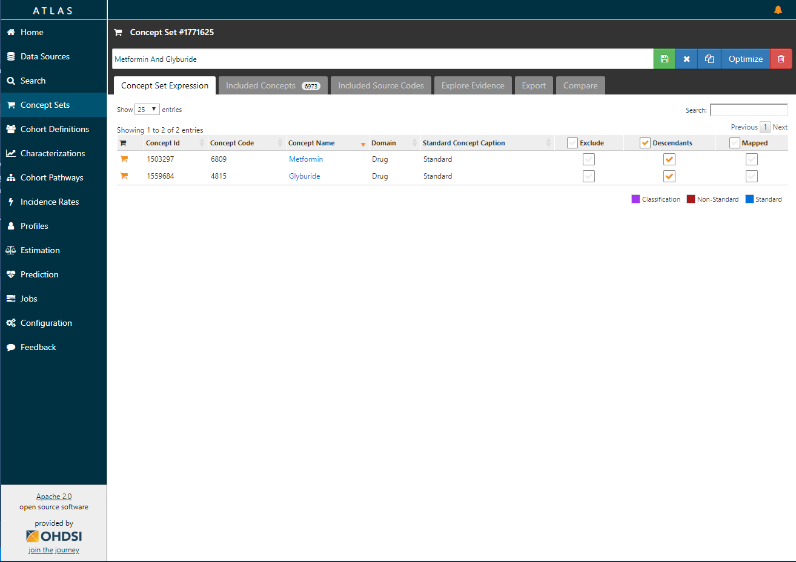

# Concept Sets

**TODO: Add in information on generating negative controls via ATLAS. Link to the CEM documentation.**

Atlas provides the ability to create concept sets: these are lists of concepts from the standardized vocabulary that taken together describe a topic of interest for a study. 

## Browsing concept sets

Selecting the Concept Sets menu option in Atlas will show you all of the concept sets available in the system. This table has filtering and sorting capabilities similar to the [[Vocabulary Search]] table. From this screen, you can click on an existing concept set to explore its definition or you can click the "Add Concept Set" button to start developing a new one.

## Creating concept sets

There are a few ways to create a concept set. One way is to browse and open existing concept sets or add a new concept set (described above). Another way is to explore the vocabulary and if you find a concept that you'd like to use to start a new concept set, click on the "shopping cart" icon which will create a new concept set and add that concept to it. Your new concept set will now appear at the top of the left hand menu. This allows you to quickly navigate back to the concept set and to indicate that it is your current working concept set. 

To add new concepts to a concept set, use the vocabulary search to find and explore concepts. When you find a concept that you'd like to add, click on the "shopping cart" icon which will add it to the current concept set.  You may also use the "shopping cart" icon to remove items from your current concept set.

### Concept set expression

Once you have one or more concepts in your concept set, you can use the concept set expression tab to further define what concepts should be included in the set. 

On the concept set expression tab, you will see the list of concepts that you have selected in a tabular format. The table has 3 checkboxes that are used to further select/deselect concepts:

  - **Exclude**: Selecting this checkbox will prevent that concept from being used in the concept set.
  - **Descendants**: Selecting this check box will use the vocabulary relationships to automatically select all descendants. If this option is used in conjunction with the exclude option, it will exclude the current concept and all descendants.
  - **Mapped**: Selecting this check box will use the vocabulary relationships to automatically select all concepts mapped to the selected concept.
	
As you define the concept set expression, you can use the other tabs to explore how the expression is evaluated against the vocabulary to select concepts.

### Included concepts

The included concept tab is used to show all of the standard concepts that are included when the concept set is evaluated. You can use this tab to review the standard concepts that are included as part of the concept set and use the filters on the left hand side to further explore the different properties of these concepts.

### Included source codes

The included source codes tab is used to show all of the non-standard concepts that are included when the concept set is evaluated. You can use this tab to review which source codes are included when the concept set is evaluated. This is useful when attempting to translate from a set of source codes (i.e. ICD9) to standard concepts to ensure that your definition is complete. It is also useful when attempting to ensure that the concept set will translate to other data sources that may have different source codes.

### Explore evidence

The evidence tab is used to display concept specific evidence from the [Common Evidence Model](https://github.com/OHDSI/CommonEvidenceModel/wiki). The evidence base is comprised of evidence found in published literature, product labels and spontaneous reports. Use the evidence sources below to find out what evidence has been associated to the concepts included in this concept set.

### Export

The export tab is used to export the concept set expression and/or the concept id list. This is useful if we need to share a concept set definition with others outside of our organization. They can then use this information to import this definition using the import functionality under the vocabulary area. 

### Compare

The compare tab is used to compare two concept set expressions. The intention of this feature is to expose differences in the way a concept has been defined between studies and expose associated differences in the study results.

### Optimize

When you have finished creating the concept set, you can use the optimize button to the right of the concept set name box to see what concepts are redundant or missing from the main concept. This feature will suggest as to how to modify the concept set by removing or adding to it to make the most parsimonious concept set. When you have reviewed the choices you can select the blue Save Options box to overwrite the current concept set or to create a new concept set. 

### Scope of concept sets

A given concept set has local scope; meaning that if you copy a concept set and modify it (by removing or changing a concept) within a new cohort it will not impact the original concept set, which may be used in alternative cohorts.  

### Domains of concept sets

It is generally not advisable to mix multiple domains (for example condition, observation, procedure) within a given concept set, however there may be times when it is required. If so the concept set can be referenced within a cohort by selecting Add New Criteria and selecting Add Condition Criteria, Add Observation Criteria, or Add Procedure Criteria and then referring to the concept set within each domain. 

### A note on use of 'at most' vs. 'exactly' in definition of concept set occurrence

When defining a criteria, at most or exactly can be used to refer to the number of times a given concept set occurs. If at most 0 or exactly 0 is used, the question of how they differ may arise. There is really no difference in the use of them, it is more a preference of style. It is advised to be consistent within a given study to use one convention vs. the other. 