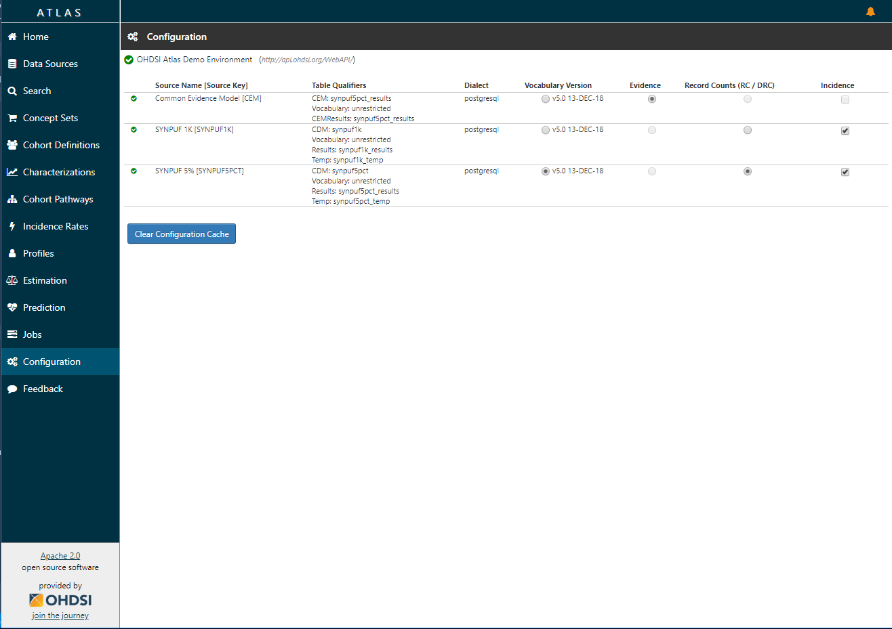

# Configuration

**TODO: Update to reflect that the data source configuration is possible with authentication enabled and configured**

Select the "configuration" menu item to review the data sources that have been configured in the source configuration section. This screen will let you review options. At this time, it cannot be used to edit the configuration  - that must be done directly in the database.

