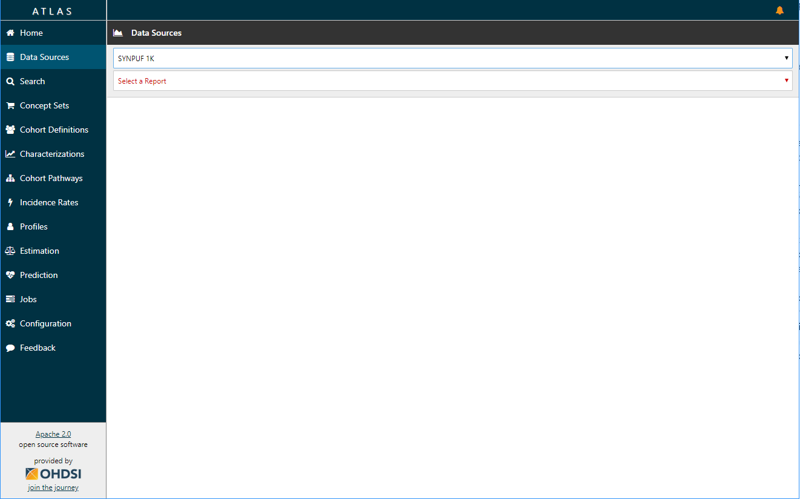
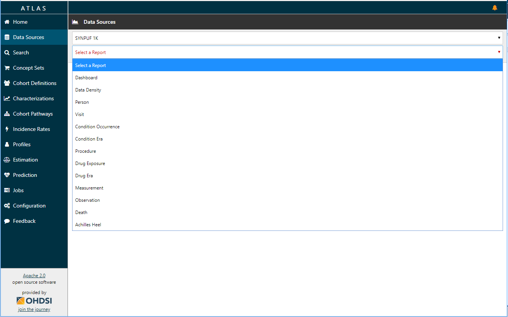
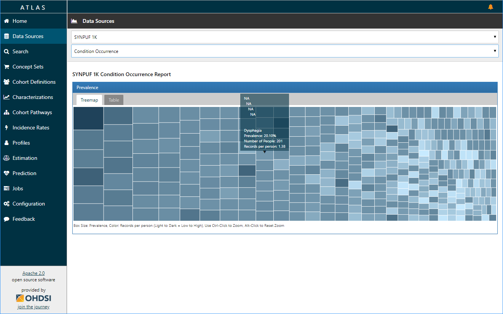
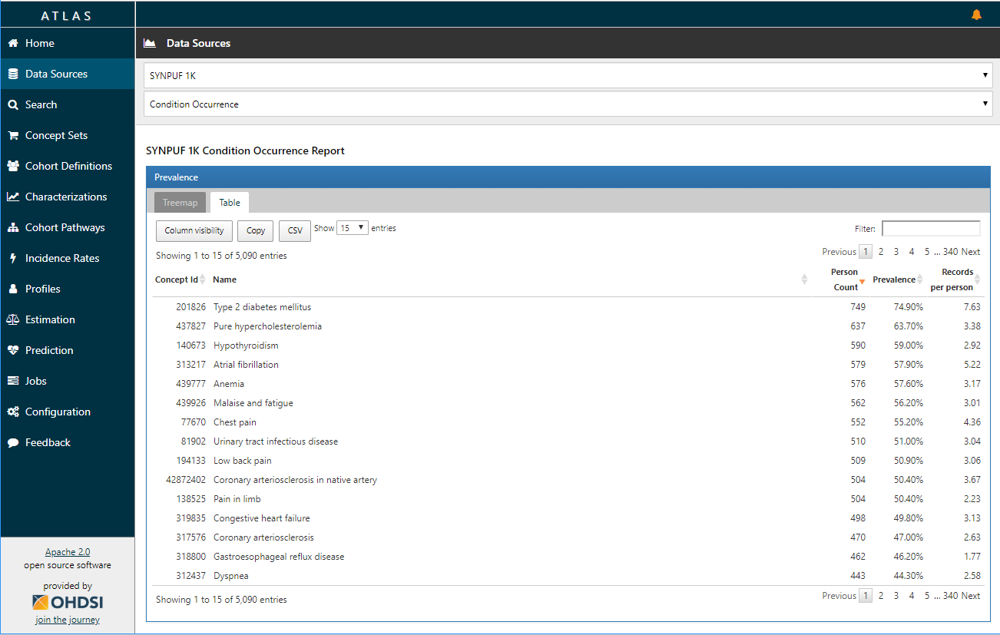
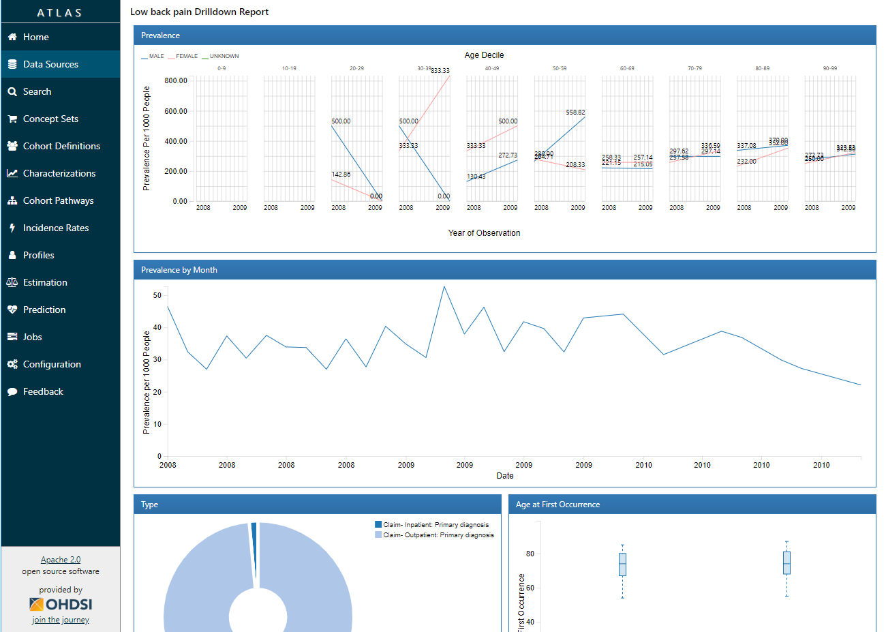

# Data Sources

ATLAS provides the ability to review descriptive statistics about an OMOP CDM. 

## Prerequisite Setup

You must run Achilles in order to use this feature in Atlas. See the [getting started guide for Achilles](https://github.com/OHDSI/Achilles#getting-started) for more details.

## Navigating Reports

In ATLAS, select the **Data Sources** menu item. Next select a data source to use for exploring the database characterization reports:

Next, use the second drop down to explore reports for the selected data source:

Certain reports provide a treemap/table view with a capability to drilldown into details for a concept. For example, the condition report provides the treemap view as a default:

Use the tabs to select the 'table' option to view a tabular display of the concepts represented in the treemap:

You can filter the results shown above by using the 'Search:' in the upper-right hand corner of the table display. Once you have a concept of interest, you can drill down by clicking on the row in the table (or a cell in the treemap) to reveal further details:

