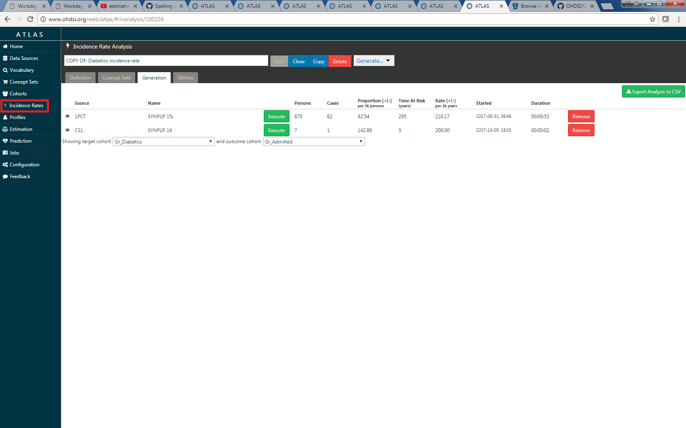

# Incidence Rates

**TODO: Expand this out to describe the standardized analytic and the role of having multiple T's and O's.** 

Incidence Rates can be generated using ATLAS by clicking on the Incidence Rate menu item and including target and outcome cohorts. Incidence rates can be generated on any of the available data sources. The incidence rate is reported as a proportion and a rate. The raw counts of people, cases, and time at risk are provided. 

