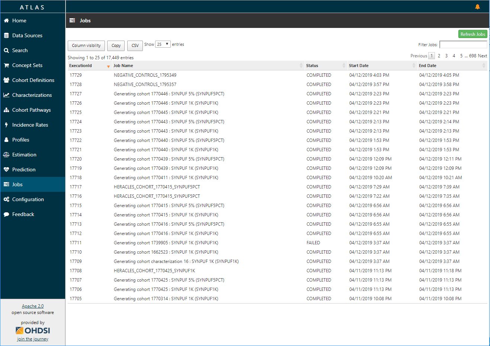

# Jobs

Select the "jobs" menu item to explore jobs that are running in the background for long running processes such as generating a cohort or computing cohort reports. You can use the "refresh jobs" button in the top-right of this screen to refresh the content if you have jobs that are currently running.

