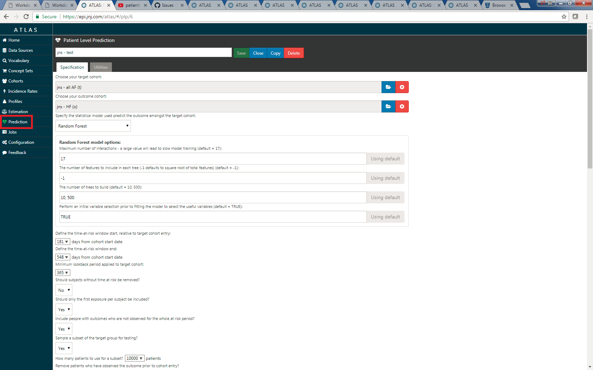

# Patient Level Prediction

**TOOD: Update everything here**

ATLAS has embedded the ability to generate prediction models using machine learning methods for precision medicine and disease interception, including:

  * Regularized regression
  * Random forest
  * k-nearest neighbors

The ATLAS prediction feature uses the R package PatientLevelPrediction that builds patient level predictive models using data in Common Data Model format.

Features:

  * Takes a cohort and outcome of interest as input.
  * Extracts the necessary data from a database in OMOP Common Data Model format.
  * Uses a large set of covariates including for example all drugs, diagnoses, procedures, as well as age, comorbidity indexes, etc.
  * Large scale regularized regression to fit the predictive models.
  * Includes function for evaluating predictive models.
  * Supported outcome models are logistic, Poisson, and survival (time to event).

This feature can be accessed by clicking on the Prediction menu item; there are options for inputs in the ATLAS prediction page. 

## OHDSI Patient Level Prediction Tutorials

- <a href="https://www.youtube.com/watch?v=y4r4VvRGSck">2018 OHDSI Patient Level Prediction Tutorial (1 of 6)</a> 
- <a href="https://www.youtube.com/watch?v=Z0Xrv00gwWg">2018 OHDSI Patient Level Prediction Tutorial (2 of 6)</a> 
- <a href="https://www.youtube.com/watch?v=E_klNJS9fEw">2018 OHDSI Patient Level Prediction Tutorial (3 of 6)</a> 
- <a href="https://www.youtube.com/watch?v=dAeXpQ9waM4">2018 OHDSI Patient Level Prediction Tutorial (4 of 6)</a> 
- <a href="https://www.youtube.com/watch?v=3kmKp2s2BeM">2018 OHDSI Patient Level Prediction Tutorial (5 of 6)</a> 
- <a href="https://www.youtube.com/watch?v=Hlp-FutRxBI">2018 OHDSI Patient Level Prediction Tutorial (6 of 6)</a>