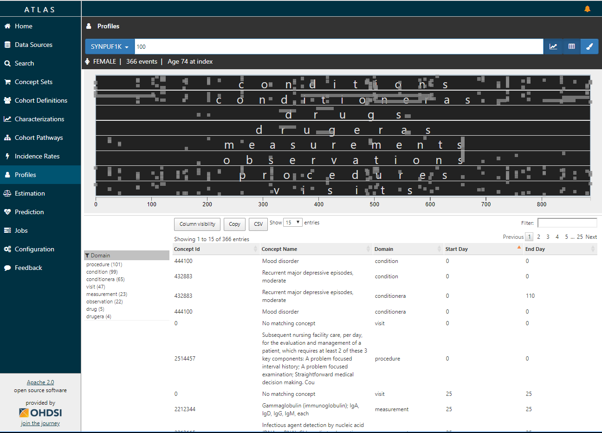
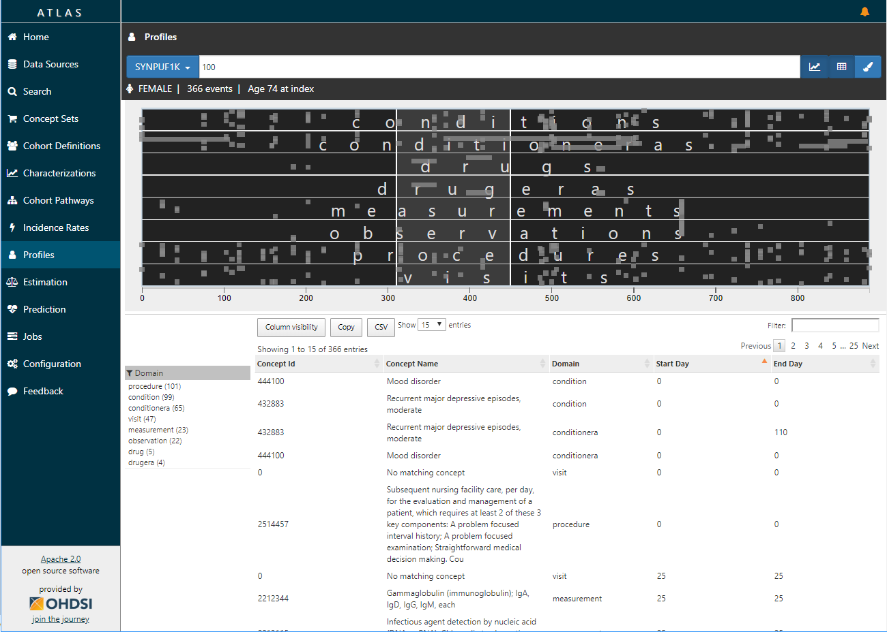

# Patient Profiles

**TODO: Update to describe how to use based on picking source, patient id, highlight events. Also how to get to this screen from the tornado plot in cohorts**

Atlas provides the ability to search and explore individual patient profiles in a database. This functionality can be accessed by clicking on the profiles menu item, selecting the database of interest, and entering a patient identification number. 

Within the profile presented the left menu lists the individual records which may be conditions, drugs, procedures etc. The table in the lower right corner lists the individual domains, concept ids, concept names, and start and end days in a given patient's record. 

The graphic can be resized to zoom in on a given time window for example the first 100 days. By changing the time window of interest the left and lower right tables change to reflect the time window of interest. 

