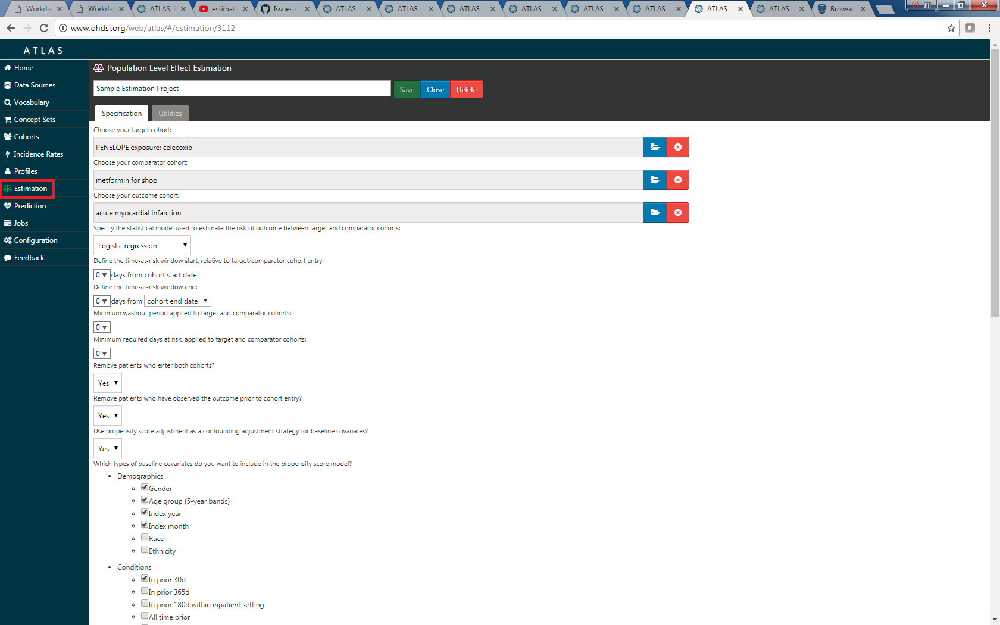

# Population Level Estimation

**TODO: Expand this documentation to touch upon the Methods Libraries and Hydra**

ATLAS has the ability to perform estimation studies using the comparative cohort design. The feature can be accessed by clicking on Estimation in the left menu. 

The estimation procedure in ATLAS uses the propensity score methodology. There are 3 main outcome models generated using the estimation feature in ATLAS - logistic regression; poisson regression; and cox proportional hazards. 

There are inputs required to design the outcome model and as such several video tutorials are available to understand and learn the estimation feature in ATLAS: 

OHDSI Estimation Methods Tutorials

- <a href="https://www.youtube.com/watch?v=ZCCz9yHy82c">2018 OHDSI Population-Level Estimation Tutorial (1 of 6)</a> 
- <a href="https://www.youtube.com/watch?v=an2e3mowQpc">2018 OHDSI Population-Level Estimation Tutorial (2 of 6)</a> 
- <a href="https://www.youtube.com/watch?v=0yCc7bRwjog">2018 OHDSI Population-Level Estimation Tutorial (3 of 6)</a> 
- <a href="https://www.youtube.com/watch?v=ylL2pFrJyDQ">2018 OHDSI Population-Level Estimation Tutorial (4 of 6)</a> 
- <a href="https://www.youtube.com/watch?v=_RPsxUr_X3M">2018 OHDSI Population-Level Estimation Tutorial (5 of 6)</a> 
- <a href="https://www.youtube.com/watch?v=j5FlSAgriZw">2018 OHDSI Population-Level Estimation Tutorial (6 of 6)</a>