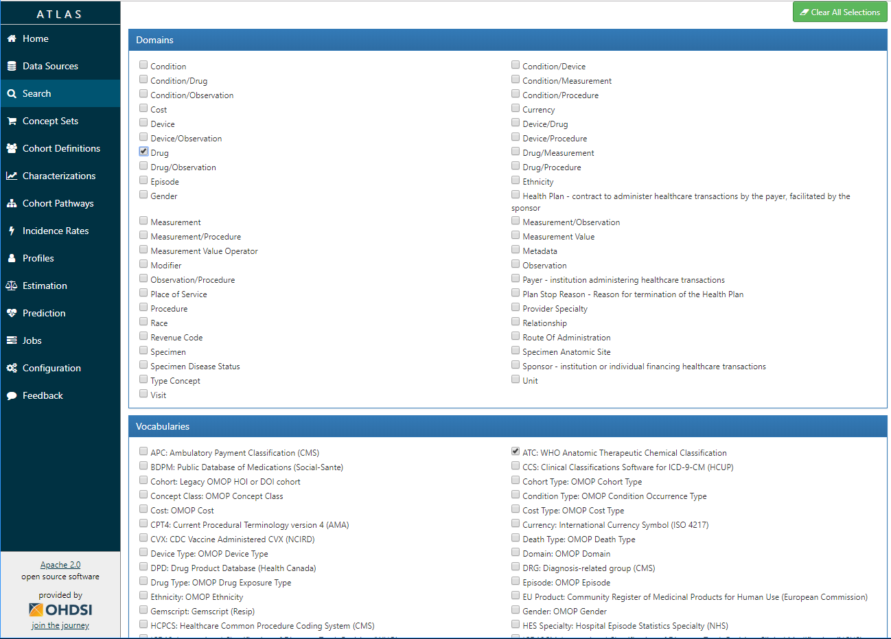
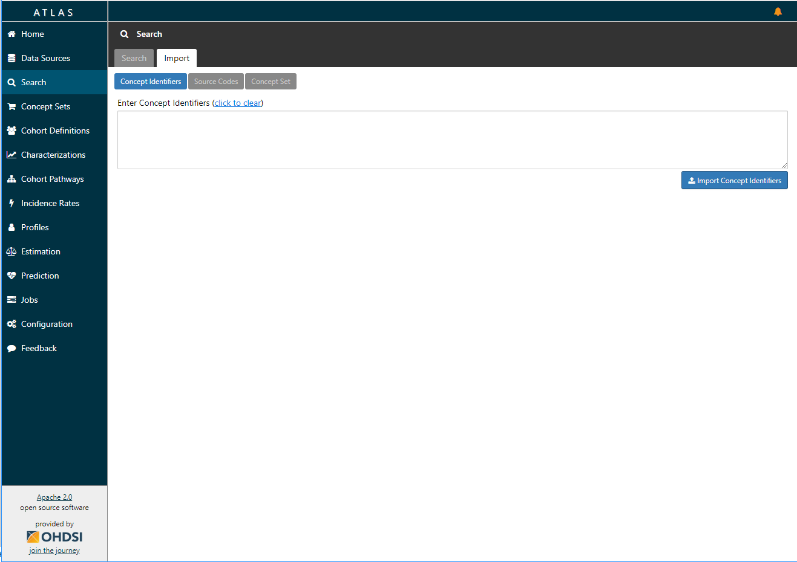

# Vocabulary Search

Atlas provides the ability to search and explore the [OMOP standardized vocabulary](http://www.ohdsi.org/web/wiki/doku.php?id=documentation:vocabulary). 

Select "Vocabulary" in the Atlas left hand menu to bring up the search screen. You will see 2 tabs: search and import. Each section will be described in more detail.

## Basic Search

Type in a search term and Atlas will search the entire standardized vocabulary for concepts that match that term. It will do a wildcard search so if you search for a term like "dementia" it will look for concepts that contain the term dementia. Once the search is complete, the results will show in the results tab.

## Advanced Search

This option is available below the 'search' button and will allow you to perform a search query and specifically filter the results down to a specific set of vocabularies and domains. 

Choose which domains and vocabularies you'd like to use to limit your search, type the search term in the search box and hit enter to search:

## Search Results

The results area will show you the results from either your basic search or advanced search. This screen will allow you to further refine your search results using the filters (red area) that appear to the left of the grid. Here are the list of filters and how they work:

  - **Vocabulary**: This will allow for filtering down to a specific vocabulary.
  - **Class**: This will allow for filtering down to a specific class of concepts.
  - **Domain**: This will allow for filtering down to a specific domain.
  - **Standard Concept**: Allows for filtering down to [standard concepts](https://github.com/OHDSI/CommonDataModel/wiki/Data-Model-Conventions#differentiating-between-source-values-source-concept-ids-and-standard-concept-ids).
  - **Invalid Reason**: This will enable for filtering out invalid concepts.
  - **Has Records**: If you have run [Achilles](https://github.com/OHDSI/Achilles#getting-started) and have configured a results daimon per the [WebAPI CDM Configuration guide](https://github.com/OHDSI/WebAPI/wiki/CDM-Configuration#schema-setup) this filter will enable you to determine which concepts contain data in your CDM.
  - **Has Descendant Records**: Similar to *Has Records*, it enables you to filter on concepts where descendant concepts contain data in your CDM based on [CONCEPT_ANCESTOR](https://github.com/OHDSI/CommonDataModel/wiki/CONCEPT_ANCESTOR).

The concepts in the results will contain the following information taken from the [CONCEPT](https://github.com/OHDSI/CommonDataModel/wiki/CONCEPT) table in the vocabulary:

  * **Concept ID**: Unique concept ID in the vocabulary
  * **Code**: The original code that is used in the source vocabulary
  * **Name**: The name of the concept. This field is color coded by: 
    * Purple: Categorization Concept
    * Blue: Standard Concept
    * Red: Non-standard concept
  * **Class**: The class of concept from the source vocabulary
  * **RC**: The **R**ecord **C**ount. This will show the number of records (not persons) that are coded with this concept in the CDM.
  * DRC: The **D**escendant **R**ecord **C**ount. The DRC column will show the sum of all records for that concept plus its descendant concepts that are coded in the CDM. 
  * **Domain**: The domain of the concept.
  * **Vocabulary**: The vocabulary associated to this concept.

The table of results also has the following features:
  * **Paging**: the default page size if 15 and this can be modified using the drop down appearing just above the results table. You can also page through the data using the paging functionality on the right side of the results table.
  * **Filtering**: There is a filter text box that appears in the upper right hand corner of the results table. Typing a term in this box will dynamically filter the results.
  * **Sorting**: The table allows for sorting on each column
  * **Shopping Cart**: Clicking on the shopping cart will allow you to select the concept for use in new [Concept Sets].  If you do not have a concept set open, this will automatically start a new concept set for you.
	
## Import

The import tab provides a means for importing concepts into a new concept set. 

This section allows you to import concepts in the following ways:

  - **Concept Identifiers**: use a list of comma delimited `concept_ids` to import concepts into a concept set
  - **Source Codes**: use a list of comma delimited `source code values` to import these concept into a concept set
  - **Concept Set**: enables you to import a JSON expression that represents a concept set